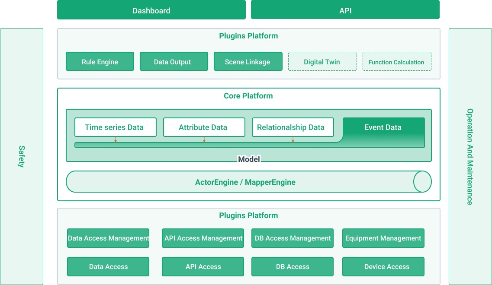
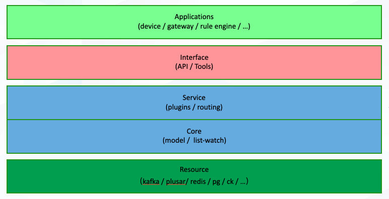

<h1 align="center"> tKeel</h1>
<h5 align="center"> Next-generation IoT open source platform </h5>
<h6 align="center"> High performance, High security and easy to use </h6> 

tKeel is a strong and reusable IoT platform that helps you build solutions quickly.

The architecture is based on a **microservices** model, providing a *pluggable architecture* and a **data plane** that is *stable and quick responsive*.

Solving the difficult problems of building an application with high performance, from device to application, modular access, etc.

[中文](README_zh.md)

## 🏃🏻‍♀️ Let's Start

* Quick installation of the tKeel platform via the [CLI](https://github.com/tkeel-io/cli#) tool
* [Example](https://github.com/tkeel-io/tkeel/tree/main/example) will help you quickly understand how to use our tKeel IoT Open Platform.

The [official website documentation]() will have details, from installation to usage details.

## 🪜 Architecture

Perhaps you are interested in the [tKeel IoT platform](), let me give you a brief introduction.

<i data-selectable-paragraph="">Architecture</i>

- ### **Resource**
Something related to data storage, which can be any database you use.
- ### **Core**
Like the name suggests, this is the data core of the entire platform, providing some **form of data organisation** as well as **processing methods**.
- Provides different forms in which data can be organised such as *time series*, _attribute_, *relationships*, etc., making data into easily understood objects that can be easily constructed and developed.
- Data interaction is resolved by means of **snapshots** and **subscriptions** (Event data).

- ### **Service**
Provides the *pluggable capability* that applications need, plus some *core functionality (message routing, tenant management, rights control)*.
- ### **Interface**
Easy *tools* and friendly *interfaces* to **Application** through encapsulation.
- ### **Application**
Applications of different volumes; can be everything your existing platform has to offer.
- Existing platforms can simply use the data they need by calling the API provided by **Interface**.

## ✅ Reasons to Trust Us

### 🥛 Keep it Simple

The `tKeel` platform summarises the generic problems encountered in IoT development over the years, as well as some tough challenges; finally there is this open platform that can solve the pain points in IoT development.

`tKeel` is good at dealing with data flow and abstraction in distributed systems, shielding the underlying complexity and providing **simpler**, **more developer-oriented** abstractions outwards to help users **quickly build* IoT solutions.

### ⛓️ Lightweight, but Powerful

The `tKeel` IoT Open Platform is based on *microservices architecture*, is not vendor-bound and offers an efficient development approach that is **scalable**, **reliable** and **high performance**.

With the power of [Dapr](https://dapr.io), a *simpler* abstraction is provided to the user in the form of [sidecar](https://docs.dapr.io/concepts/dapr-services/sidecar/), interacting via `HTTP` and `gRPC`.

The `tKeel` platform allows your code to ignore the hosted environment, allowing device docked applications/plugins **highly portable** and **not restricted by programming language**, allowing developers to develop to their heart's content using their preferred technology stack.

### 🔌 Pluginisation

The Plugin implementation is based on the **OpenAPI convention**, making deployment simple and lightweight through a cloud-native approach.

The plugin mechanism makes it easy to reuse plugins that you or others have made public.

We provide an [Official Plugin Repository]() where developers can pick and choose plugins for their own scenarios. Of course, if you can make your plugins publicly available, developers with similar needs would appreciate it.

With [Plugin Guide]() you will find that implementing plugins is a very simple task.

### 📊 Focus on Data

The `tKeel` IoT Open Platform defines **data entities** through a data centre ([tKeel-io/Core](https://github.com/tkeel-io/core ) ) and simulates and abstracts real-world objects (things).

You can define **relational mappings** for more, faster and easier data refinement through the platform's powerful capabilities.

With the design of **data entities**, we can adapt this abstract design to *messages*, _measurement points_, *objects* and *relationships*, and the platform provides **multi-level** and **multi-latitude** data services.

Configuring **relational mapping** eliminates the need to remember complex `Message Topics` and `Message Formats` as we provide a high performance data processing solution.

## 🛣️ Roadmap

We have planned a [roadmap](https://github.com/tkeel-io/tkeel/issues/30)  to do more support for the project.

## 💬 Shall We Talk

If you have any suggestions or ideas, you are welcome to file an [Issue](https://github.com/tkeel-io/keel/issues ) at any time, we'll look forward to sharing them together to make the world a better place.

**Thank you very much** for your `feedback` and `suggestions`!

[Community Documents](docs/development/README.md) will give you an idea of how you can start contributing to tKeel.

### 🙌 Contributing

[The Development Guide](docs/development/developing-tkeel.md) explains how to configure your development environment.

We have this [Code of Conduct] that we expect project participants to follow. Please read it in full so that you know what will and will not be tolerated.

### 🌟 Find Us

You may have many questions, and we will ensure that they are answered as soon as possible!

| Social Platforms | Links |
|:---|----|
|email| tkeel@yunify.com|
|Weibo| [@tkeel]()|

## 🏘️ Repos

| repo | Descriptions |
|:-----|:------------|
| [tKeel](https://github.com/tkeel-io/tkeel) | As what you see, the code for the platform and an overview of the platform are included|
| [CLI](https://github.com/tkeel-io/cli) | The tKeel CLI is the main tool for various tKeel-related tasks |
| [Helm](https://github.com/tkeel-io/helm-charts) | Helm charts corresponding to tKeel |
| [Core](https://github.com/tkeel-io/core) |  tKeel's data centre |

