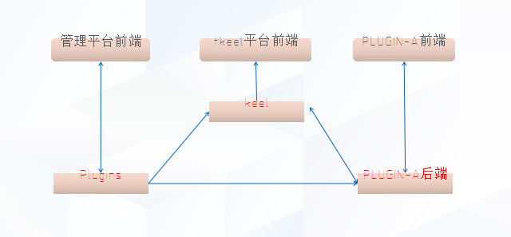
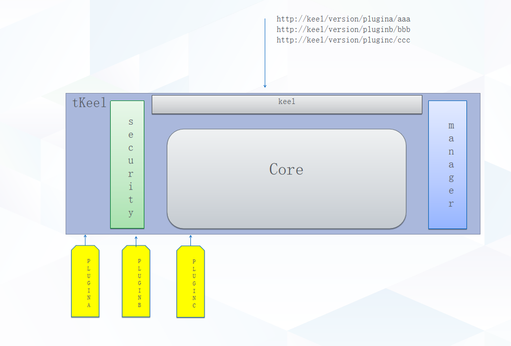

# ARC-001-core-plugin-componentization

## Status
Accepted

## Context
v0.1.0 版本验证了 OPENAPI 机制的可行性，在 v0.2.0 版本中则是进一步的完善 OPENAPI 的机制，提供更方便的插件管理平台，提供更完善的权限控制功能。

TKeel 平台核心架构 v0.2.0 整体形态大致如下：

核心功能实现 OPENAPI 再接入平台的模式在 v0.1.0 版本的开发过程中体现出了很多不便。故列出优劣进行分析，是否将核心功能去除插件化，以组件的形态直接通过 dapr 的 service 进行访问。

* 核心功能插件化的弊端：
  1. 现在的 TKeel 平台中，提供核心功能的程序也实现了 OPENAPI 并以插件的形式接入到平台中。导致核心插件间的互相调用需要走插件间调用的逻辑。

  2. 为了将对外暴露的 API 进行美化处理，需要将提供平台控制功能的一个插件取名为 Plugins，不是非常合理。

  3. 插件化之后的核心程序缺乏一定的统一性。

* 核心功能插件和的优势：
  1. 整体概念更加统一，插件化后可将核心功能程序以插件的机制进行管理。

## Decision
Auth 插件提出作为单独仓库，作为架构中安全部分。

Plugins 改名为 Manager，并提供前端服务，作为整个平台的管理界面，提供插件、租户和平台的资源的管理。

Manager 的前端有单独入口，与平台无关，仅平台管理员可登录。

Keel 代码需重构，在现有功能的基础上将把插件的权限控制的功能加上。

Keel 提供单独的前端，并采用微前端架构，也是普通平台用户的入口。

## Consequences
`docs/decision_records` 中需要新增 `component_manager` 目录，原有 `plugin-xxx` 废弃并改名为 `plugin-xxx-abandoned`。

`docs/decision_records/decision_records.md` 中修改相关文档。

改版后的代码结构添加在 `docs/decision_records/architecture/` 下。