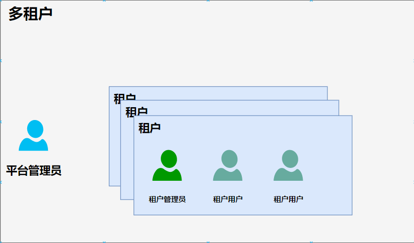
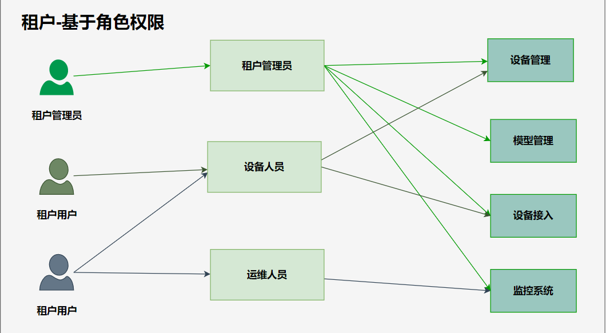

# auth模块整体设计记录
auth模块功能主要有：用户系统、授权服务。
## 相关定义
**平台** - tkeel开源平台，可以通过[cli](../cli/CLI-001-k8s-init-and-uninstall-behaviors.md)安装

**平台管理员** - 即安装tKeel平台的操作员，可通过[cli]()进行插件管理，租户管理等

**租户** - 由平台管理员创建的有一定的平台插件以及数据隔离的空间

**租户管理员** - 角色 随租户的创建默认创建，拥有整个租户空间的所有权限，租户管理员的角色可在租户空间内创建租户用户、角色等

**租户用户** - 由租户管理员创建

**角色** - 由租户管理员创建

**插件** - 即通过tKeel平台插件注册流程注册的可插拔的功能模块

**实体** - 这里的实体指插件中需要接入平台的一类数据的抽象，如设备管理中的 设备

## 用户系统
### 多租户
 用户系统设计为多租户体系,租户由系统管理员创建，可以理解租户为一个用户组，租户内可创建用户，角色。
 
### 基于角色权限控制
 租户内可设置角色权限控制，例如基于角色插件权限：
 

## 授权服务

授权服务为用户，实体提供授权以及认证的服务。
授权服务为登录用户提供access token作为身份标识，用户携带access token认证通过方可访问平台。
授权服务为实体颁发token，实体数据接入平台时可通过token作为身份标识

### 用户授权

### 实体授权